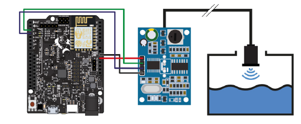
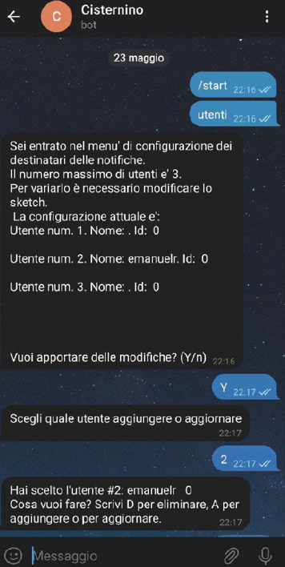
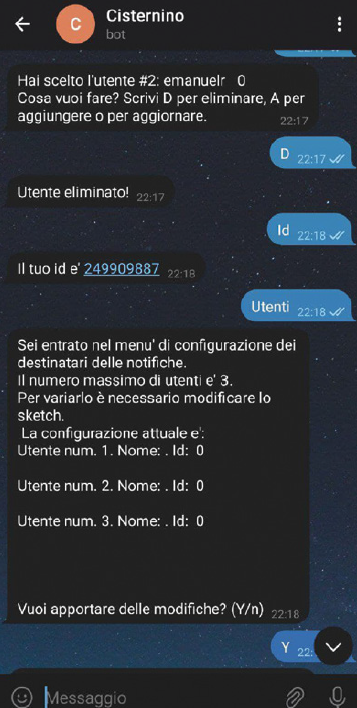
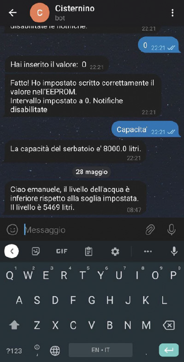

# Cisternino

Questa è una piccola introduzione al mio progetto pubblicato su [ElettronicaIN #256](https://futuranet.it/prodotto/n-256-luglio-agosto-2021/).

Si tratta di un un dispositivo in grado di rilevare la quantità di acqua presente all'interno di una cisterna e di inviare delle notifiche agli utenti mediante un bot Telegram. Soglia di allerta e intervallo di notifica sono configurabili tramite bot.

# Hardware necessario

- [Fishino 32](https://futuranet.it/prodotto/board-fishino-32-bit/)

- [Sensore di misura a ultrasuoni impermeabile](https://futuranet.it/prodotto/sensore-di-misura-a-ultrasuoni/)

- Jumper

- Alimentatore 5V DC

- Scatola di plastica per l'elettronica

# Cablaggio



# Software

Creiamo un bot Telegram facendo uso di BotFather.

Per la relizzazione del progetto sono state utilizzate le librerie Arduino/[Fishino](https://fishino.it/download-libraries-it.html):

- Fishino (per gestire la connettività via WiFi)

- JSONStreamingParser (per il parsing "al volo" dei dati JSON )

- Every (per eseguire del codice ad intervalli regolari senza utilizzare i delay() )

- FishGram (per gestire le API Telegram)

- FishinoEEPROM (per salvare le configurazioni e mantenerle anche dopo lo spegnimento della scheda)

- ctype e string (per gestire i caratteri e le stringhe)

Per utilizzare la scheda Fishino 32 è necessario installare i [packages](https://fishino.it/arduino-ide-packages-it.html)) necessari.

Editate il codice seguente in base alle vostre necessità (se vi servono  più utenti)

```arduino
#define trigPin 2 //Pin che genera l’impulso
#define echoPin 3 //Pin per la lettura del ritorno
#define slot_soglia 2 //slot EEPROM di partenza per il salvataggio della soglia di allerta
#define slot_intervallo 9 // slot EEPROM di partenza per il salvataggio dell’intervallo di lettura
#define EEPROM_Data_Start 20 //slot EEPROM di partenza per il salvataggio dei dati degli utenti
#define num_utenti 3 //numero utenti presenti nella configurazione. MODIFICARE IN BASE ALLE NECESSITA’
uint32_t intervallo; //intervallo di lettura
uint32_t soglia; // soglia di allerta
```

Modificate i seguenti paremetri in base alla cisterna in uso.

In particolare, indicate la sagoma della cisterna (se rettangolare o circolare) e le dimensioni. Il programma calcolerà in automatico il volume.

```arduino
#define RECT // OR CIRC
#if defined(RECT)
float larghezza = 1;
float lunghezza = 2;
float altezza = 4;
float superficie = larghezza * lunghezza; //calcola la superficie dello specchio d’acqua
float volume = superficie * altezza * 1000; //calcola il volume della cisterna (in metri cubi)
float valore_massimo_misurazione;
#elif defined(CIRC)
float pi = 3.1415;
float raggio = 0;
float altezza = 2.5;
float superficie = ((raggio) ^ 2 * pi); //calcola la superficie dello specchio d’acqua
float volume = superficie * altezza * 1000; //calcola il volume della cisterna (in metri cubi)
float valore_massimo_misurazione = 2.5;
#else
#error “Formato non supportato”
#endif 
```

Ricordiamoci di inserire i parametri di confiurazione della rete WiFi e la chiave API del bot Telegram.

# Caricamento dello sketch e configurazione del bot

Una volta caricato lo sketch, avviamo il bot e utilizziamo i comandi definiti nel programma per configurare gli utenti e la gestione delle notifiche, come nelle immagini riportate di seguito.



# Risultato finale

Una volta terminata la configurazione del bot, se il livello dell'acqua sarà al di sotto di una certa soglia, riceveremo un messaggio come nell'immagine riportata di seguito.




Sentiti libero  di modificare lo sketch, di apportare tutte le migliorie necessarie e di inviare le pull requests!